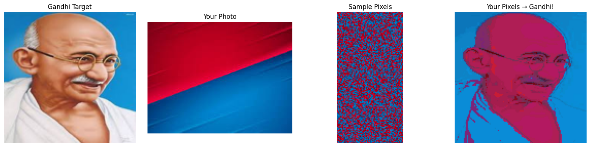

# Pixel-to-Gandhi (Colab)

Rearrange the pixels of any photo to form a Gandhi-portrait-like mosaic.

## Output preview

## What it does
- Takes a target Gandhi portrait (the “shape” to recreate).
- Takes your source photo (the pixel “paint”).
- Reorders/samples your photo’s pixels to match the target portrait’s colors, creating a mosaic that looks like Gandhi.

## How to use
1. Open the notebook in Google Colab (GPU optional).
2. Run the single cell in the notebook.
3. Upload a clear Gandhi portrait first (target).
4. Upload your photo second (source).
5. View the output: target, source, sampled pixels, final mosaic.

## Tips
- Faster preview: use target size 64×64.
- Better quality: use 128×128 or 256×256 (slower).
- Works best with a high-contrast Gandhi portrait and a colorful source image.

## License
MIT (or choose any license you prefer).
